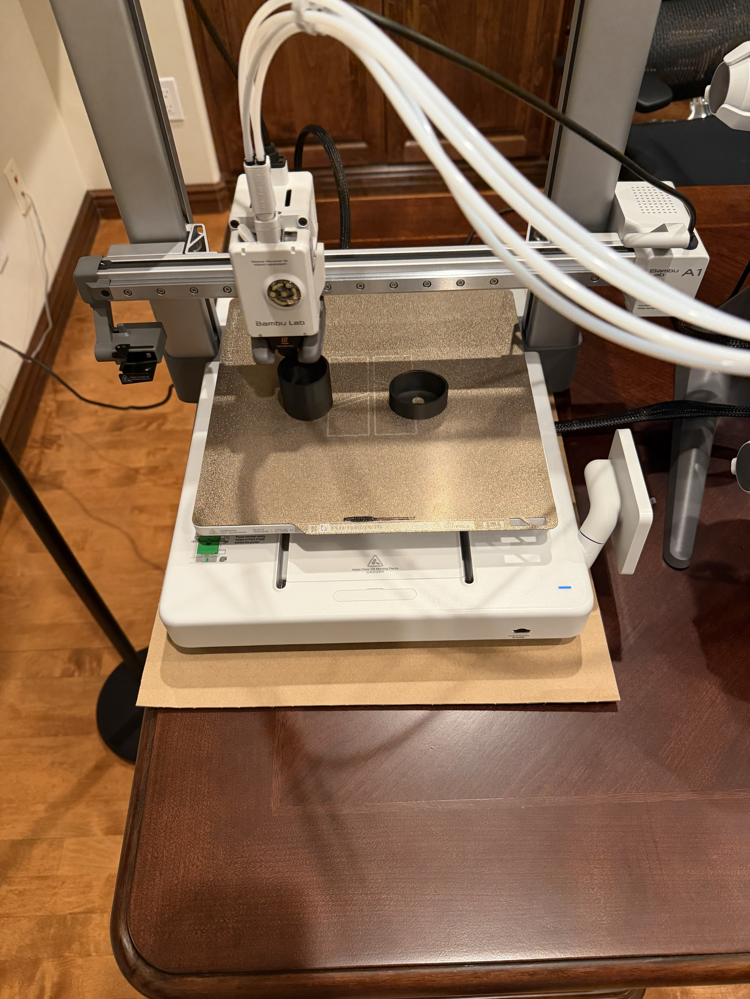
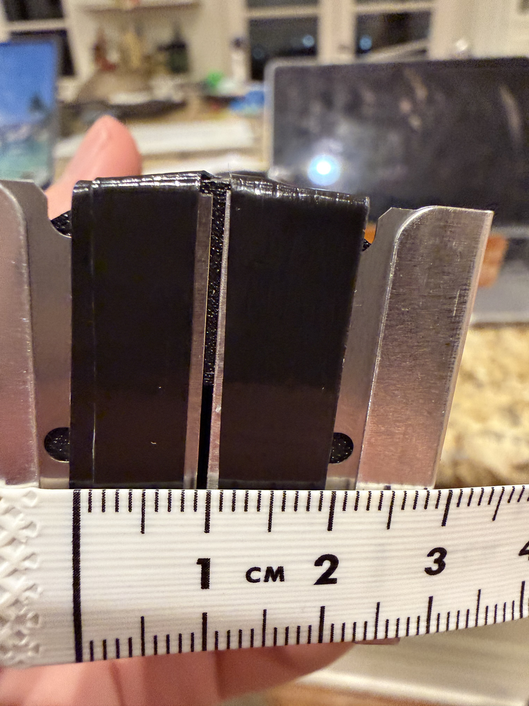
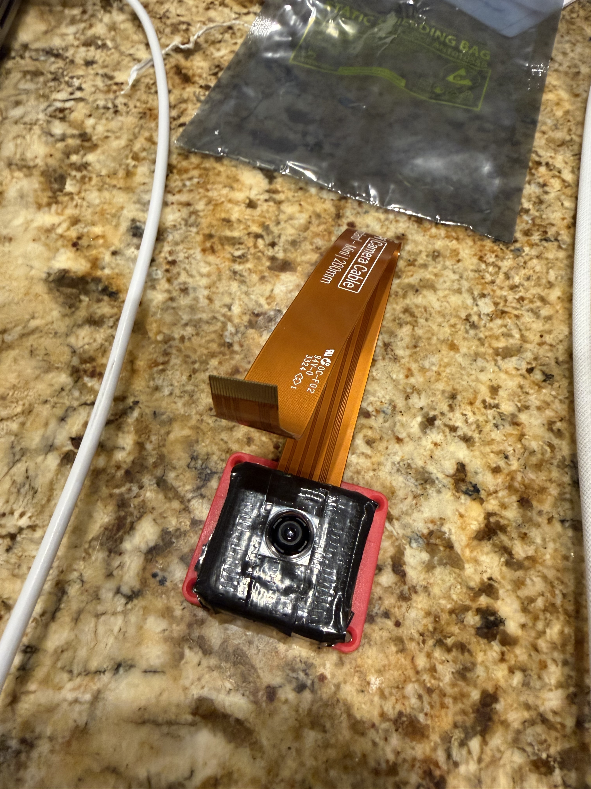
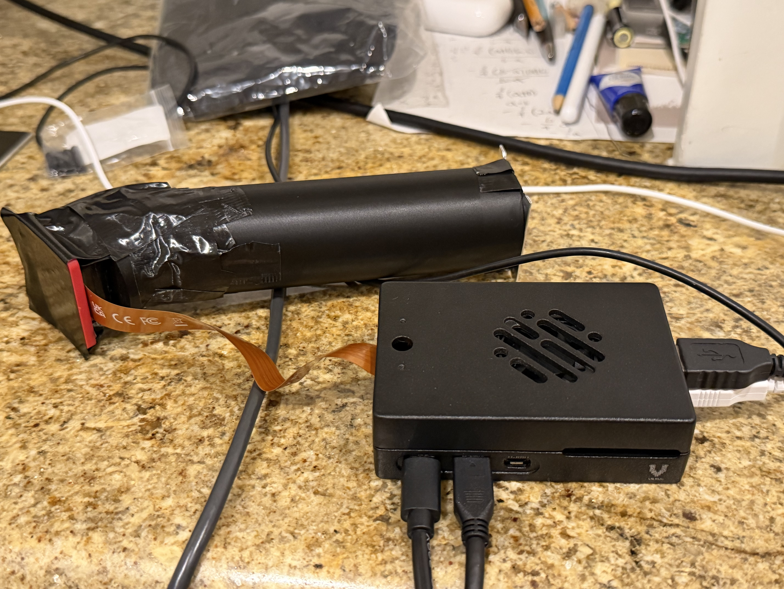
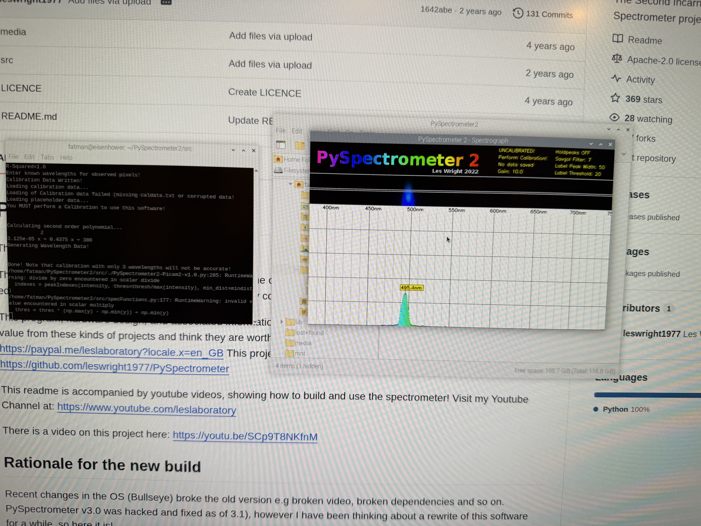

# Raspberry Pi 3D-Printed Spectrometer

## Overview

I created a 3D-printed spectrometer using readily available components and a Bambu A1 printer. The spectrometer uses a 1,000 lines/mm diffraction grating to spatially separate incoming light by wavelength, a Raspberry Pi Camera Module 3 to capture the spectrum, a 15–22 pin FFC cable, and a Raspberry Pi 5 to process the data and display the spectrum graphically.

While this spectrometer operates in the visible light range (400–700nm) and cannot directly measure pollutant concentrations, it can detect the optical signature of wildfire smoke in the solar spectrum. Fine aerosol particles scatter blue wavelengths more than red, producing a measurable spectral shift during smoke events that reflects the same differential wavelength scattering principles used by professional atmospheric instruments. During Southern California fire season, this instrument will be pointed at the sky through a white paper diffuser to capture solar spectra. These readings will be compared against clear-day baseline measurements taken earlier in the year to gauge pollution levels during fire season.

---

## Video

[https://youtu.be/KasW3qDfX2g](https://youtu.be/KasW3qDfX2g)

---

## Features

- Design the optical enclosure using Shapr3D computer-aided design (CAD) software
- Export the STL file and print using a Bambu A1 3D printer
- Add two razors to narrow and more sharply define the slit that captures light
- Use a diffraction grating to separate light into its component wavelengths
- Capture the dispersed spectrum using a Raspberry Pi Camera Module 3
- Process the camera data using a Raspberry Pi 5
- Convert the captured spectrum into a graphical representation of intensity as a function of wavelength
- Calibrate the instrument using light sources with known wavelength values

---

## Main Optical Design

The design is made up of two components.

### Primary Component — Main Cylindrical Enclosure

A long cylindrical enclosure with the following features:

- Narrow entrance slit at bottom end: 2×10mm
- Angled opening at the top end
- Bottom end cover: 1mm thick, 40mm in diameter
- Angled opening at top: 33° relative to bottom surface
- Body height: 130mm at lowest point, 153mm at highest point (not including bottom end cover)
- Body outer diameter: 40mm; inner diameter: 36mm
- Angled opening at top creates an elliptical interface rather than a circular one

### Secondary Component — Elliptical Camera Assembly

A shorter cylinder with the following features:

- Base matches the elliptical face on the top of the primary component
- Base is open and sits on the angled top of the primary component, over the diffraction grating
- Height: 15mm (not including top cover)
- Top cover: 1mm thick, closed except for a 10.5mm diameter circular opening centered on the ellipse

### Dimensional Math

The dimensions of the spectrometer were determined using the grating equation for light hitting normal (90°) to the grating surface:

```
d · sin θ = m · λ
```

Where:

- `m` = Spectral order = 1 (first-order rainbow)
- `λ` = Wavelength = 550nm (green/yellow, center of visible spectrum)
- `d` = Line spacing (grating period)

**Step 1 — Calculate d (spacing between grating lines)**

The grating has 1,000 lines/mm:

```
d = 1mm / 1000 = 0.001mm = 1000nm
```

**Step 2 — Solve for θ₁ (first-order diffraction angle)**

```
sin θ₁ = (m · λ) / d = (1 · 550nm) / 1000nm = 0.55

θ₁ = arcsin(0.55) = 33.37°
```

---

## 3D Printing

Use Shapr3D or another CAD application to design the enclosure. Export as an STL file and print using a 3D printer. Black PLA filament is optimal to reduce stray light and internal reflections. The CAD/STL files are included in this repository so the design can be reproduced.

---

## Razors

Attach two single-edge razor blades to the slit at the bottom of the main cylinder to create a narrow, precise opening for a sharper spectrum. Place the razors over the slit facing each other, 1mm apart, and secure using black duct tape.

---

## Diffraction Grating

Place the diffraction grating at the angled end of the main cylinder and secure using black duct tape.

Orient the grating so that its glass surface faces inward toward the entrance slit and the diffracted side faces outward toward the camera assembly.

To determine the line direction of the grating, hold it up to a light source — the rainbow spectrum spreads perpendicular to the direction of the lines. Orient the grating so that its lines are parallel to the slit at the base of the cylinder.

When light enters through the slit, it travels through the main optical chamber and strikes the diffraction grating. The grating separates the incoming light into its component wavelengths, which appear at different positions across the camera's field of view.

---

## Camera Module

Use a Raspberry Pi Camera Module 3 as the optical detector. Enclose the module in an ABS Housing IMX519 16MP 25×24mm camera board case.

Secure the two 3D-printed components together using black duct tape. Attach the camera module within its case to the elliptical cylinder component using black duct tape. Orient the lens so that it is positioned directly over the circular opening of the elliptical cylinder. The camera lens sits 15mm above the diffraction grating and receives the light dispersed by the grating.

---

## Computational Platform

Connect the Camera Module 3 to a Raspberry Pi 5 using the camera's 15–22 pin FFC cable.

The Raspberry Pi 5 will:

- Capture images from the camera
- Process the image data
- Calibrate pixel position to wavelength
- Generate a graphical representation of intensity vs. wavelength

---

## Installation

```bash
# ============================================================
# Install PySpectrometer2
# Original software by Les Wright (leswright1977)
# https://github.com/leswright1977/PySpectrometer2
# Licensed under GNU GPL v3.0
# ============================================================

# 1. Clone the repository
git clone https://github.com/leswright1977/PySpectrometer2
cd PySpectrometer2

# 2. Install dependencies the correct way for Pi OS Bookworm
#    (do NOT use pip for opencv — use apt to avoid conflicts
#    with the system Picamera2 installation)
sudo apt-get update
sudo apt-get install -y python3-opencv python3-picamera2 python3-scipy python3-numpy

# 3. Install peakutils (not available via apt on Bookworm)
pip3 install peakutils --break-system-packages

# 4. Navigate to the src directory where the scripts live
#    (note: scripts are NOT in the root directory)
cd src

# 5. Make the Picamera2 version executable
chmod +x PySpectrometer2-Picam2-v1.0.py

# 6. Verify the Camera Module 3 is detected before running
#    (if no camera appears, check ribbon cable orientation —
#    contacts face toward USB ports on Pi 5)
libcamera-hello --list-cameras

# 7. Launch the spectrometer
./PySpectrometer2-Picam2-v1.0.py

# ============================================================
# EXPECTED RESULT:
# A window opens showing:
#   TOP PANEL    — live camera feed with sampling line
#   BOTTOM PANEL — real-time wavelength vs intensity graph
#
# If the window does not open, check that your Pi is connected
# to a monitor. PySpectrometer2 requires a display to run.
# SSH alone is insufficient — use SSH with X11 forwarding or
# run directly from the Pi desktop.
# ============================================================
```

---

## Calibration

Red and green XIMIBI laser pens with known wavelengths were initially used to calibrate the instrument by establishing a relationship between camera pixel position and wavelength. The laser pointers were reflected off cardboard placed approximately 25mm from the slit. Neither produced sufficient signal for reliable peak detection — diffuse reflection off the cardboard surface reduced intensity to levels too low for the camera to detect a clean spectral peak.

A broadband white flashlight was then tested by shining it at a piece of cardboard placed approximately 25mm from the slit. This produced a strong, stable spectrum across the full visible range (400–700nm), and known wavelength values were entered at reference peaks in the software. However, while the top panel showed a single clean spectrum, this calibration attempt yielded multiple repeated spectra in the graphical representation in the bottom panel.

The default calibration built into PySpectrometer2 was then applied without manual adjustment. This correctly bounded the x-axis to the visible wavelength range (approximately 400–700nm), eliminated the repeated spectra artifact in the bottom panel, and produced a single clean wavelength-intensity curve aligned closely with expected reference wavelengths.

---

## Project Structure

```
README.md
shapr3d_export_2026-08-16_17h39m.stl
images/
    3DPrinting.jpeg
    Slit.jpg
    CameraModule.jpg
    FullSpectrometer.jpg
    Blue_Light.jpg
```

---

## Images







---

## Author

Jackson Mayer — [jacksonmayer1](https://github.com/jacksonmayer1)

---

## License

This project is licensed under the MIT License — see the [LICENSE](LICENSE) file for details.

The software used in this project is not original work and is not covered by this license. See the Acknowledgements section below for the applicable license.

---

## Acknowledgements

Spectrometer software based on PySpectrometer2
by Les Wright (leswright1977)
[https://github.com/leswright1977/PySpectrometer2](https://github.com/leswright1977/PySpectrometer2)
Licensed under GNU GPL v3.0
